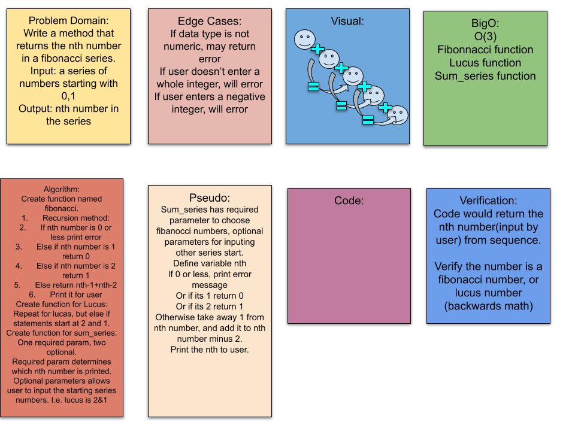

# Console Application README Example

## About Me Quiz

Lab02-Modules and Testing 

*Author: Nebiyu Kifle*

----

## Description
***[Tell me about your application, should be about a paragraph]***
- The name of fibonacci Function should have one paramenter (n) and return the nth value in the fibonacci series.

- The name of lucas Function that returns the nth value in the lucas numbers again
The name of sum_series Function with one required parameter and two optinoal paramenters.
- The required parameter will determine which element in the series to print.The two optional parameters will have default value of 0 and 1, and will determine the first two values for the series to be produce.

---

### Getting Started
Clone this repository to your local machine.

```
$ git clone : https://github.com/neba9/snakes-cafe.git
```

### To run the program from VS Code:
Select ```math_series File``` -> ```Open``` -> ```Project/Solution```

Next navigate to the location you cloned the Repository.

Double click on the ```math_series``` directory.

Then select and open ```series.py```file.
To see test code open ```test_series.py```file.

---

### Visuals
***[Add screenshots of your application in action]***

#### Application Start

#### Using the Application

#### Application End


---

### Change Log
***[The change log will list any changes made to the code base. This includes any changes from TA/Instructor feedback]***  
1.3: *Added summary comments to the methods* - 8 Nov 2010  
1.2: *Changed variable names to follow proper convention* - 6 Nov 2010  
1.1: *Added a Try/Catch/Finally for Question 2* - 5 Nov 2010  

###### collaborate with Audrena Vacirca

------------------------------
- sources link: https://www.pythonpool.com/fibonacci-series-in-python/
- https://www.codespeedy.com/print-nth-iteration-of-lucas-sequence-in-python/